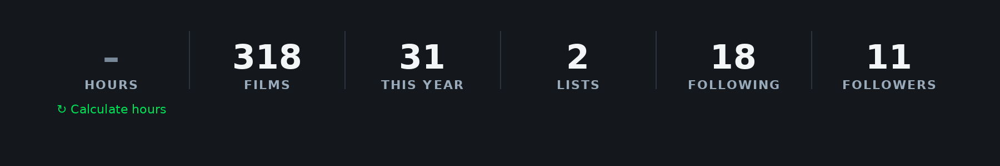
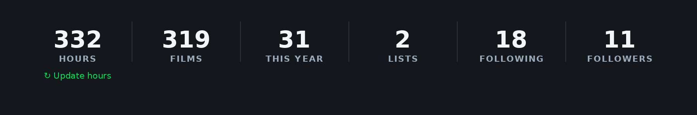

# Letterboxd Hours

A Chrome/Edge extension (Manifest V3 + TypeScript) that adds an **HOURS** stat to
any Letterboxd profile — the total time that person has spent watching films —
right next to **FILMS**, styled exactly like the native counters.

---

## Quick start

You need [Node.js](https://nodejs.org) 18 or newer.

```bash
npm install      # 1. install dev tools (esbuild, typescript)
npm run build    # 2. compile into the dist/ folder
```

Then load the `dist/` folder into your browser:

**Chrome**
1. Go to `chrome://extensions`
2. Turn on **Developer mode** (top-right toggle)
3. Click **Load unpacked** and pick the **`dist/`** folder

**Edge**
1. Go to `edge://extensions`
2. Turn on **Developer mode** (left sidebar)
3. Click **Load unpacked** and pick the **`dist/`** folder

Open any profile (e.g. `https://letterboxd.com/iagoesteevezz/`), click
**"Calculate hours"** once, and you're done. After that the hours show instantly.

---

## Demo

**First calculation** — click **Calculate hours**, watch it work, get your total:



**Updating after watching new films** — click **Update hours** and it only
fetches the new ones (instant):



---

## How to use it

| You see… | What it means | What to do |
|---|---|---|
| **Calculate hours** | First time on this profile | Click it once to calculate |
| A number (e.g. `332`) | Hours are cached and up to date | Nothing — it's instant |
| A number + **Update hours** | You watched new films since last time | Click to add just the new ones |
| A number + **Finish calculation** | The last run was interrupted (you reloaded mid-scrape) | Click to finish it — it resumes from where it stopped |
| **Calculating… 12/40** | It's working | Wait — it's fetching runtimes |

(Button labels appear in your browser's language — the table shows the English ones.)

If you reload the page while it's still calculating, nothing is lost: the
progress it had already fetched is saved, the partial result is shown, and a
**Finish calculation** button lets you finish (it picks up where it left off).

The first calculation on a big profile takes a little while (it has to read every
film's runtime, slowly and politely). Every visit after that is instant.

---

## How it works (short version)

Letterboxd has no public API, so the extension reads the public pages directly:

1. It reads your **FILMS** count straight from the profile.
2. It collects the list of films you've watched.
3. It opens each film page once to read its runtime, then adds them all up.
4. It saves the result, so it never has to do that work twice.

To stay fast **and** kind to Letterboxd's servers, it uses three strategies:

- **Instant** — if nothing changed since last time, it just shows the saved value.
- **Update (delta)** — if you added a few films, it only looks at the *new* ones
  and adds their minutes to the saved total. It never re-checks old films.
- **Full** — only the very first time, or if something looks off.

It also limits how fast it makes requests (a few at a time, with short pauses) so
it behaves like a normal visitor and won't get your IP throttled.

---

## Project layout

```
letterboxd-hours/
├── build.mjs            # compiles src/ → dist/
├── package.json
├── tsconfig.json
├── public/
│   ├── manifest.json    # extension config (MV3)
│   └── icons/           # toolbar icons
└── src/
    ├── content.ts       # injects the HOURS box into the page + handles the UI
    ├── background.ts    # does all the page-reading and caching
    ├── parser.ts        # pulls slugs / runtimes out of the HTML
    ├── rateLimiter.ts   # "a few requests at a time" throttle
    ├── storage.ts       # save/load helpers
    └── types.ts         # shared types
```

---

## Developing

```bash
npm run watch       # rebuild automatically when you edit a file
npm run typecheck   # check types without building
```

After a rebuild, click the **reload** icon on the extension card in
`chrome://extensions` to pick up your changes.

If you ever want to start fresh, open the extension's service worker console
(`chrome://extensions` → **Letterboxd Hours** → **service worker**) and run:

```js
chrome.storage.local.clear()
```

---

## Tuning the speed

In `src/background.ts` you can adjust how aggressive the scraping is:

```ts
const CONCURRENCY = 6;    // how many film pages to fetch at once
const DELAY_MS    = 250;  // pause between requests (ms)
```

Higher = faster but pushier. If you ever see `HTTP 429` (Too Many Requests) in the
service worker console, lower these.

---

## Notes & limits

- The extension relies on Letterboxd's current page structure. If they redesign
  the site and the count stops working, the patterns to update live in
  `src/parser.ts` and the `findStats()` function in `src/content.ts`.
- Films with no published runtime count as 0 minutes.
- It reads pages while you're logged in, so private/friends-only diary entries
  are included exactly as you see them.
